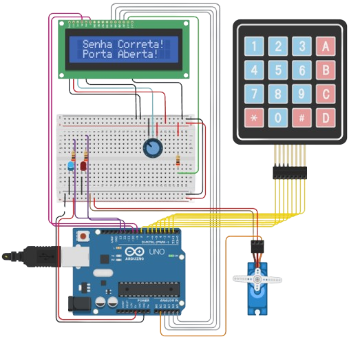

<div align="center" style="display: inline_block;">
  <a href="https://learn.microsoft.com/pt-br/cpp/cpp/?view=msvc-170" title="C++ | DOC" target="_blank" rel='noopener noreferrer'>
    
  </a>
    &nbsp;&nbsp;&nbsp;&nbsp;&nbsp;
  <a href="https://docs.arduino.cc/" title="Arduino | DOC" target="_blank" rel='noopener noreferrer'>
    
  </a>
</div><br>

<div align="center";>
  <h1>CONTROLADOR DE ACESSO 🔐</h1>
</div>

Este projeto implementa um mecanismo de controle de acesso com senha, usando um teclado, um display LCD, LEDs e um motor servo. O sistema bloqueia e desbloqueia com base na senha digitada, fornecendo retorno visual através de LEDs e do display LCD.

## 🧰 Componentes Utilizados

- Placa Arduino (Arduino Uno R3);
- Placa de ensaio pequena;
- Dois LEDs (Azul e Vermelho);
- Resistores (200 Ω);
- Potenciômetro (250 KΩ);
- Jumpers (Fios para conexão);
- Micro servo;
- Teclado 4x4;
- LCD 16 x 2.

## 📋 Diagrama de Circuito

| Componente | Pino Arduino |
|------------|--------------|
| LED Vermelho | 12           |
| LED Azul    | 13           |
| Servo       | A1           |
| LCD RS      | 9            |
| LCD EN      | 10           |
| LCD D4      | A2           |
| LCD D5      | A3           |
| LCD D6      | A4           |
| LCD D7      | A5           |
| Teclado R1  | 8            |
| Teclado R2  | 7            |
| Teclado R3  | 6            |
| Teclado R4  | 5            |
| Teclado C1  | 4            |
| Teclado C2  | 3            |
| Teclado C3  | 2            |
| Teclado C4  | 1            |

## ⚙️ Como Funciona

1. **Configuração Inicial**: Inicializa os componentes e define o estado inicial do acesso (bloqueado).
2. **Loop**: Verifica continuamente a entrada do teclado.
   - Se `#` ou `*` for pressionado, a entrada é resetada.
   - Caso contrário, verifica a tecla digitada contra a senha.
   - Se a senha digitada estiver correta, o sistema é desbloqueado.
   - Se incorreta, solicita ao usuário para tentar novamente.

## 🔄 Retorno Visual

- **LED Vermelho**: Indica que o sistema está bloqueado;
- **LED Azul**: Indica que o sistema está desbloqueado;
- **Display LCD**: Fornece instruções e retorno ao usuário.

## 📜 Explicação das Funções

### `void setup()`

Esta função é chamada uma vez quando o Arduino é inicializado. Aqui, os componentes são configurados e o estado inicial do sistema é definido.

```cpp
void setup() {
  Serial.begin(9600);
  pinMode(redLed, OUTPUT);
  pinMode(blueLed, OUTPUT);
  pinMode(servo, OUTPUT);
  lcd.begin(16, 2);
  servoMotor.attach(servo);
  setLocked(locked);
  lcd.setCursor(1, 0);
  lcd.print("Digite a senha");
  delay(2000);
  lcd.clear();
}
```

- Inicializa a comunicação serial com `Serial.begin(9600)`.
- Define os pinos dos LEDs e do servo como saídas.
- Inicializa o display LCD com `lcd.begin(16, 2)`.
- Anexa o motor servo ao pino especificado.
- Chama a função `setLocked(true)` para definir o estado inicial como bloqueado.
- Exibe a mensagem "Digite a senha" no display LCD.

### `void loop()`

Esta função é chamada repetidamente e contém a lógica principal do programa.

```cpp
void loop() {
  char key = teclado.getKey();

  if (key) {
    if (key == '#' || key == '*') {
      lcd.clear();
      hits = 0;
      tries = 0;
      delay(200);
      locked = true;
      setLocked(locked);
    } else {
      tries++;
      lcd.print("*");

      if (key == password[hits]) {
        hits++;
      }

      if (tries == totalKeys) {
        tries = 0;

        if (hits == totalKeys) {
          hits = 0;
          locked = false;
          setLocked(locked);
          lcd.clear();
          lcd.setCursor(1, 0);
          lcd.print("Senha Correta!");
          lcd.setCursor(1, 1);
          lcd.print("Porta Aberta!");
          delay(5000);
          lcd.clear();
          locked = true;
          setLocked(locked);
        } else {
          locked = true;
          setLocked(locked);
          lcd.clear();
          lcd.setCursor(1, 0);
          lcd.print("Senha Errada!");
          delay(2000);
          lcd.clear();
          lcd.setCursor(0, 0);
          lcd.print("Tente Novamente");
          delay(2000);
          lcd.clear();
        }

        delay(200);
      }
    }
  }
}
```

- Obtém a tecla pressionada no teclado com `teclado.getKey()`.
- Se a tecla `#` ou `*` for pressionada:
    - O display LCD é limpo.
    - As variáveis `hits` e `tries` são resetadas.
    - O sistema é bloqueado chamando `setLocked(true)`.

- Se outra tecla for pressionada:
    - A variável `tries` é incrementada.
    - Um asterisco é exibido no display LCD.
    - Se a tecla digitada estiver correta, `hits` é incrementado.
    - Se o número de tentativas for igual ao tamanho da senha:
        - As tentativas são resetadas.
        - Se todos os caracteres estiverem corretos:
            - O sistema é desbloqueado chamando `setLocked(false)`.
            - Mensagens de sucesso são exibidas no display LCD.
            - Após um atraso, o sistema é bloqueado novamente.
        - Se a senha estiver incorreta:
            - Mensagens de erro são exibidas no display LCD.
            - Após um atraso, o display é limpo para uma nova tentativa.

### `setLocked(bool locked)`

Esta função define o estado do acesso.

```cpp
void setLocked(bool locked) {
  if (locked) {
    digitalWrite(redLed, HIGH);
    digitalWrite(blueLed, LOW);
    servoMotor.write(0);
  } else {
    digitalWrite(redLed, LOW);
    digitalWrite(blueLed, HIGH);
    servoMotor.write(90);
  }
}
```

- Se `locked` for `true`:
    - **O LED 🔴:** é aceso.
    - **O LED 🔵:** é apagado.
    - **O motor servo:** é movido para a posição de bloqueio (0 graus).

- Se `locked` for `false`:
    - **O LED 🔴:** é apagado.
    - **O LED 🔵:** é aceso.
    - **O motor servo:** é movido para a posição de desbloqueio (90 graus).

## 📸 Imagem do Projeto em Funcionamento

<div align="center">
  <table>
    <tr>
      <td align="center">
        
      </td>
    </tr>
    <tr>
      <td align="center">
        <b>Figura 1:</b> Projeto do controlador de acesso em funcionamento.
      </td>
    </tr>
  </table>
</div>
